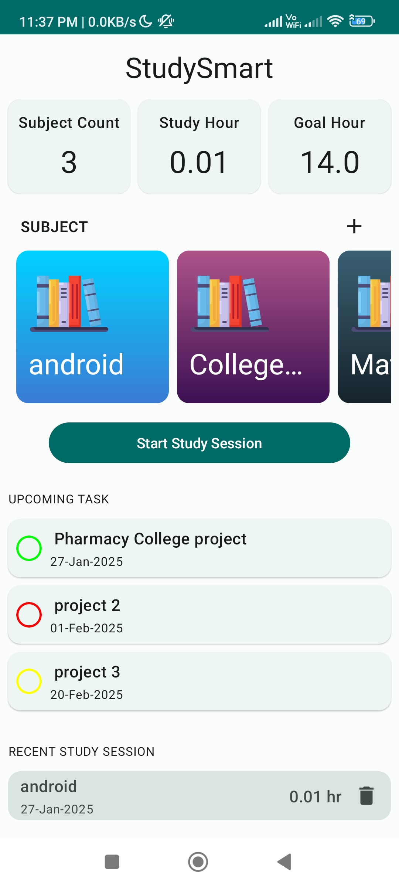
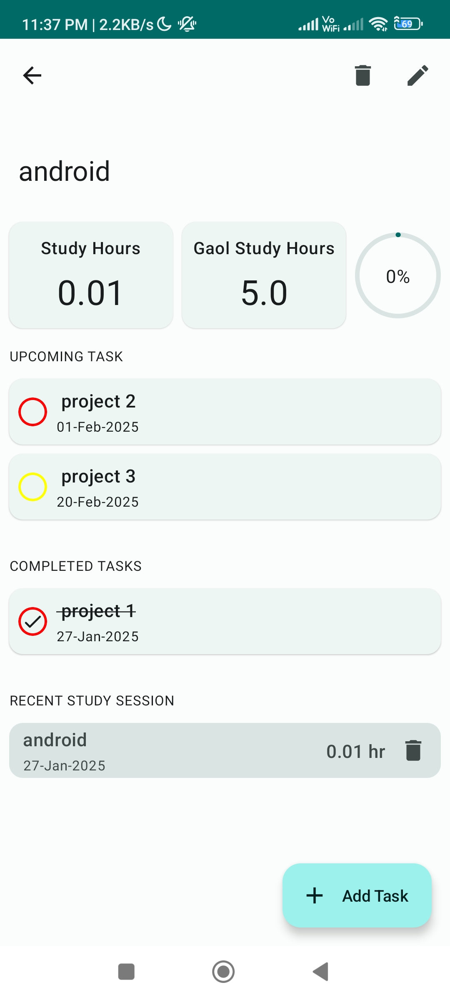
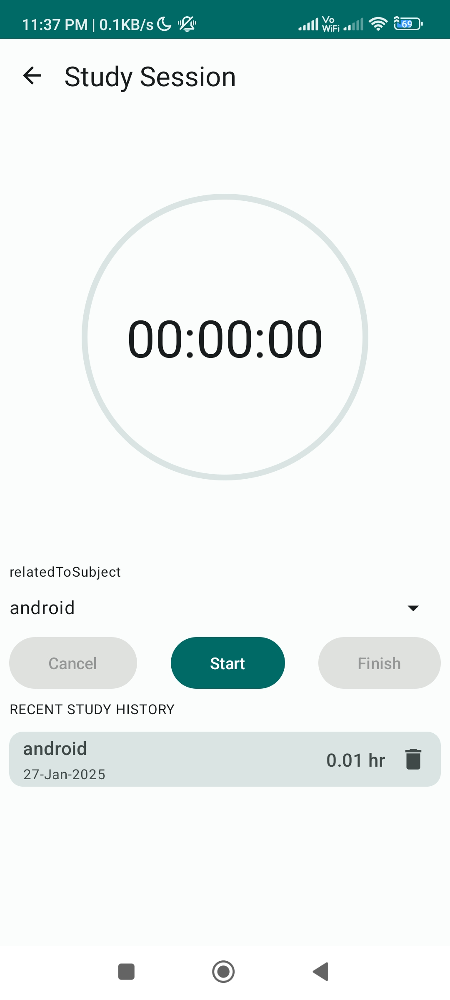
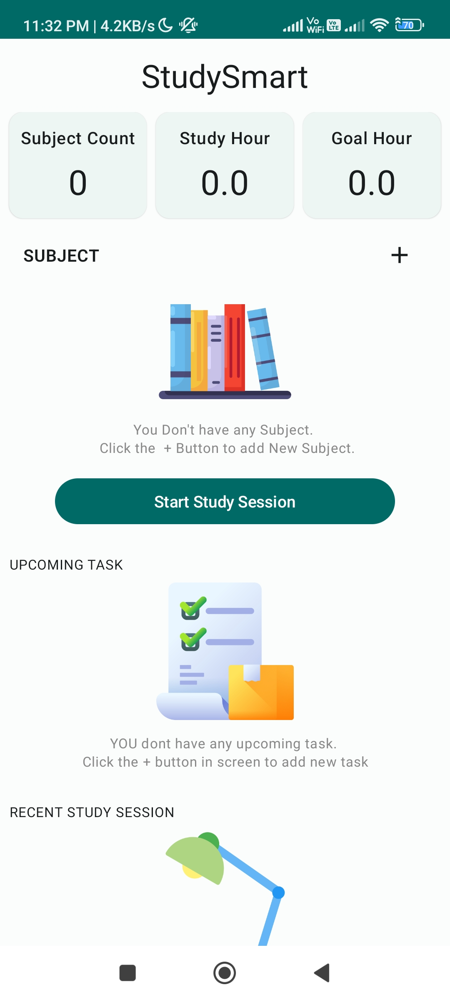

#Project 1: StudySmart 

     StudySmarApp is my first industry level project complete which reference from YT 
and cover most for concept and enhance skills better way form this project 
 
## Cover Topic
- Jectpack-Compose-UI 
- Oop
- Room-DB
- Compose-destination
- downgrade-Android-Studio
- Dagger-hilt
- Service

## Images

   
