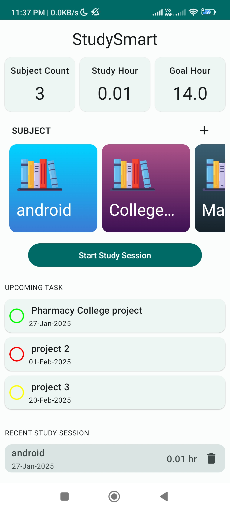
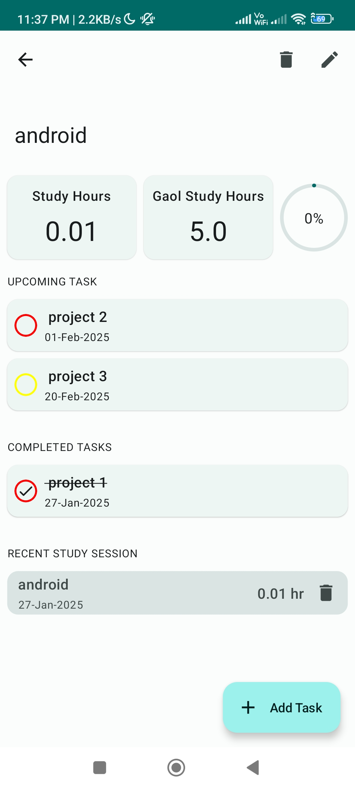
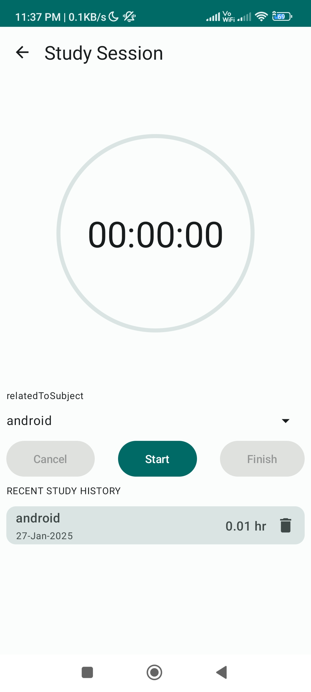

# Project 1: StudySmart 

StudySmarApp is my first industry level project complete which reference from YT 
and cover most of concept and enhance skills better way form this project 
 
## Cover Topic
- Jectpack-Compose-UI 
- Oop
- Room-DB
- Compose-destination
- downgrade-Android-Studio
- Dagger-hilt
- Service

## Images

  
  
  
  

